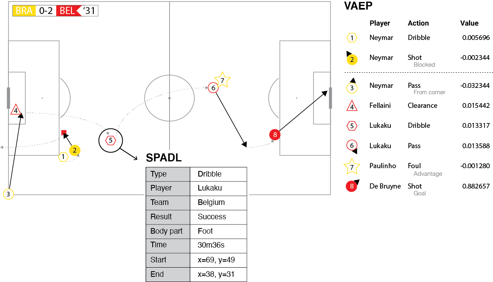
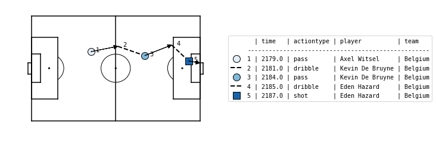

# Socceraction
`socceraction` is a Python package for objectively quantifying the impact of the individual actions performed by soccer players. It contains two components:

- **SPADL** (Soccer Player Action Description Language): a unified and expressive language for on-the-ball player actions.
- **VAEP** (Valuing Actions by Estimating Probabilities): a framework to value actions on their expected impact on the score line.

<br/>
<p align="center">
  
</p>

## Installation / Getting started

The recommended way to install `socceraction` is to simply use pip:

```
$ pip install socceraction
```

`socceraction` officially supports Python 3.6--3.8.

The folder `public-notebooks` provides a demo of the full pipeline from raw StatsBomb data to action values and player ratings.

## How it works
`socceraction` uses event stream data to value the individual actions performed by soccer players. Computing these action values requires the three steps described below. 


### 1. Conversion from event stream format to SPADL

SPADL is a language for describing player actions, as opposed to the formats by commercial vendors that describe events. The distinction is that actions are a subset of events that require a player to perform the action. For example, a passing event is an action, whereas an event signifying the end of the game is not an action. SPADL was designed to be _human-interpretable_, _simple_ and _complete_ to accurately define and describe actions on the pitch. Unlike all other event stream formats, we always store the same attributes for each action. Excluding optional information snippets enables us to store our data in a table and more easily apply automatic analysis tools.

This package currently supports converters for [Opta](https://www.optasports.com), [Wyscout](https://www.wyscout.com), and [StatsBomb](https://www.statsbomb.com) event stream data.

Here is an example of five actions in the SPADL format leading up to Belgium's second goal against England in the third place play-off in the 2018 FIFA world cup.


|   game_id |   period_id |   seconds | team    | player          |   start_x |   start_y |   end_x |   end_y | actiontype   | result   | bodypart   |
|-----------|-------------|-----------|---------|-----------------|-----------|-----------|---------|---------|--------------|----------|------------|
|      8657 |           2 |      2179 | Belgium | Axel Witsel     |      37.1 |      44.8 |    53.8 |    48.2 | pass         | success  | foot       |
|      8657 |           2 |      2181 | Belgium | Kevin De Bruyne |      53.8 |      48.2 |    70.6 |    42.2 | dribble      | success  | foot       |
|      8657 |           2 |      2184 | Belgium | Kevin De Bruyne |      70.6 |      42.2 |    87.4 |    49.1 | pass         | success  | foot       |
|      8657 |           2 |      2185 | Belgium | Eden Hazard     |      87.4 |      49.1 |    97.9 |    38.7 | dribble      | success  | foot       |
|      8657 |           2 |      2187 | Belgium | Eden Hazard     |      97.9 |      38.7 |   105   |    37.4 | shot         | success  | foot       |


Here is the same phase visualized using the `matplotsoccer` package
```
matplotsoccer.actions(
    location=actions[["start_x", "start_y", "end_x", "end_y"]],
    action_type=actions.type_name,
    team=actions.team_name,
    result= actions.result_name == "success",
    label=actions[["time_seconds", "type_name", "player_name", "team_name"]],
    labeltitle=["time","actiontype","player","team"],
    zoom=False
)
```



### 2. Estimating scoring and conceding probabilities

The intuition is that all good actions should aim to  

<ol type="a">
  <li>increase the <i>chance of scoring</i> a goal in the short-term future and/or,</li>
  <li>decrease the <i>chance of conceding</i> a goal in the short-term future.</li>
</ol>

Valuing an action for a team then requires assessing the change in probability for both scoring and conceding as a result of an action. Therefore, `socceraction` converts each game state to a feature-vector format and trains a probabilistic classifier to estimate the probabilities of scoring and conceding in the near future for both teams.

### 3. Compute VAEP values

An action moves the game state from one state to another. Using the probabilities computed in the previous step, we can define the *offensive value* of an action as the change in scoring probability before and after the action. This change will be positive if the action increased the probability that the team which performed the action will score (e.g., a successful tackle to recover the ball). Similarly, we define the *defensive value* of an action as the change in conceding probability. This change will be positive if the action increased the probability that the team will concede a goal (e.g., a failed pass). Finally, the total VAEP value of an action is the difference between that action's offensive value and defensive value.

We can also aggregate the individual action values into a player rating for multiple time granularities (i.e., a single game or a full season) as well as per action type.


## Research

For more information about SPADL and VAEP, read our SIGKDD paper **"Actions Speak Louder Than Goals: Valuing Player Actions in Soccer"** available on ACM (https://dl.acm.org/citation.cfm?doid=3292500.3330758) and Arxiv (https://arxiv.org/abs/1802.07127).

If you make use of this package or the ideas in our paper, please use the following citation:
```
@inproceedings{Decroos2019actions,
 author = {Decroos, Tom and Bransen, Lotte and Van Haaren, Jan and Davis, Jesse},
 title = {Actions Speak Louder Than Goals: Valuing Player Actions in Soccer},
 booktitle = {Proceedings of the 25th ACM SIGKDD International Conference on Knowledge Discovery and Data Mining},
 series = {KDD '19},
 year = {2019},
 isbn = {978-1-4503-6201-6},
 location = {Anchorage, AK, USA},
 pages = {1851--1861},
 numpages = {11},
 url = {http://doi.acm.org/10.1145/3292500.3330758},
 doi = {10.1145/3292500.3330758},
 acmid = {3330758},
 publisher = {ACM},
 address = {New York, NY, USA},
 keywords = {event stream data, probabilistic classification, soccer match data, sports analytics, valuing actions},
} 
```
