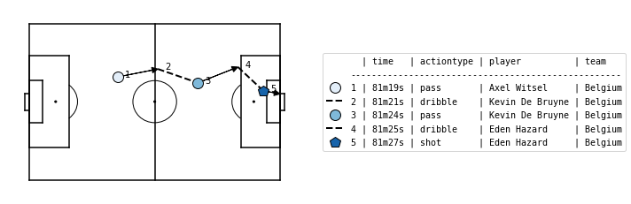
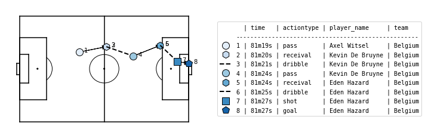

*********************
Data representation
*********************

Socceraction uses **a tabular action-oriented data format**, as opposed to the
formats by commercial vendors that describe events. The distinction is that
actions are a subset of events that require a player to perform the action.
For example, a passing event is an action, whereas an event signifying the end
of the game is not an action. Unlike all other event stream formats, we always
store the same attributes for each action. Excluding optional information
snippets enables us to store the data in a table and more easily apply
automatic analysis tools.

Socceraction implements two versions of this action-oriented data format: :ref:`SPADL`
and :ref:`Atomic-SPADL`.

.. _SPADL:

SPADL
=====

Definitions
-----------

SPADL (*Soccer Player Action Description Language*) represents a game as
a sequence of on-the-ball actions :math:`[a_1, a_2, . . . , a_m]`, where
:math:`m` is the total number of actions that happened in the game. Each
action is a tuple of the same twelve attributes:

.. list-table::
  :widths: 20 80
  :header-rows: 1

  * - Attribute
    - Description
  * - game_id
    - the ID of the game in which the action was performed
  * - period_id
    -  the ID of the game period in which the action was performed
  * - seconds
    -  the action's start time
  * - player
    -  the player who performed the action
  * - team
    -  the player's team
  * - start_x
    -  the x location where the action started
  * - start_y
    -  the y location where the action started
  * - end_x
    -  the x location where the action ended
  * - end_y
    -  the y location where the action ended
  * - action_type
    -  the type of the action (e.g., pass, shot, dribble)
  * - result
    -  the result of the action (e.g., success or fail)
  * - bodypart
    -  the player's body part used for the action

Start and End Locations 
  SPADL uses a standardized coordinate system with the origin on the bottom
  left of the pitch, and a uniform field of 105m x 68m. The direction of play
  corresponds to the direction in the original event stream data, but can be
  converted conveniently with the :func:`~socceraction.spadl.play_left_to_right`
  function such that the lower x-coordinates represent the own half of the team
  performing the action.

Action Type 
  The action type attribute can have 22 possible values. These are `pass`,
  `cross`, `throw-in`, `crossed free kick`, `short free kick`, `crossed
  corner`, `short corner`, `take-on`, `foul`, `tackle`, `interception`,
  `shot`, `penalty shot`, `free kick` `shot`, `keeper save`, `keeper claim`,
  `keeper punch`, `keeper pick-up`, `clearance`, `bad touch`, `dribble` and
  `goal kick`. A detailed definition of each action type is available
  :doc:`here <SPADL_definitions>`.
Result
  The result attribute can either have the value `success`, to indicate that
  an action achieved it’s intended result; or the value `fail`, if this was
  not the case. An example of a successful action is a pass which reaches
  a teammate. An example of an unsuccessful action is a pass which goes over
  the sideline. Some action types can have special results. These are
  `offside` (for passes, corners and free-kicks), `own goal` (for shots), and
  `yellow card` and `red card` (for fouls).
Body Part 
  The body part attribute can have 4 possible values. These are `foot`, `head`,
  `other` and `none`. For Wyscout, which does not distinguish between the
  head and other body parts a special body part `head/other` is used.

Example
-------

Socceraction currently supports converters for `Opta <https://www.optasports.com>`__,
`Wyscout <https://www.wyscout.com>`__, and `StatsBomb <https://www.statsbomb.com>`__ event stream data. 
The Opta converter is also compatible with derived formats, such as the ones
used by WhoScored and Stats Perform. We'll use StatsBomb data to illustrate
the API, but the API of the other converters is identical. 

First, we load the event stream data of the third
place play-off in the 2018 FIFA World Cup between Belgium and England.

.. code-block:: python

  from socceraction.data.statsbomb import StatsBombLoader

  SBL = StatsBombLoader()
  df_events = SBL.events(game_id=8657)

These events can now be converted to SPADL using the :func:`~socceraction.spadl.statsbomb.convert_to_actions`
function of the StatsBomb converter.

.. code-block:: python

  import socceraction.spadl as spadl

  df_actions = spadl.statsbomb.convert_to_actions(df_events, home_team_id=777)

The obtained dataframe represents the body part, result, action type, players
and teams with numeric IDs. The code below adds their corresponding names.

.. code-block:: python

  df_actions = (
    spadl.add_names(df_actions)
    .merge(SBL.teams(game_id=8657))
    .merge(SBL.players(game_id=8657))
  )

Below are the five actions in the SPADL format leading up to Belgium's
second goal.

+---------+-----------+---------+---------+-----------+----------+----------+--------+--------+------------+---------+----------+
| game_id | period_id | seconds | team    | player    | start\_x | start\_y | end\_x | end\_y | actiontype | result  | bodypart |
+=========+===========+=========+=========+===========+==========+==========+========+========+============+=========+==========+
| 8657    | 2         | 2179    | Belgium | Witsel    | 37.1     | 44.8     | 53.8   | 48.2   | pass       | success | foot     |
+---------+-----------+---------+---------+-----------+----------+----------+--------+--------+------------+---------+----------+
| 8657    | 2         | 2181    | Belgium | De Bruyne | 53.8     | 48.2     | 70.6   | 42.2   | dribble    | success | foot     |
+---------+-----------+---------+---------+-----------+----------+----------+--------+--------+------------+---------+----------+
| 8657    | 2         | 2184    | Belgium | De Bruyne | 70.6     | 42.2     | 87.4   | 49.1   | pass       | success | foot     |
+---------+-----------+---------+---------+-----------+----------+----------+--------+--------+------------+---------+----------+
| 8657    | 2         | 2185    | Belgium | Hazard    | 87.4     | 49.1     | 97.9   | 38.7   | dribble    | success | foot     |
+---------+-----------+---------+---------+-----------+----------+----------+--------+--------+------------+---------+----------+
| 8657    | 2         | 2187    | Belgium | Hazard    | 97.9     | 38.7     | 105    | 37.4   | shot       | success | foot     |
+---------+-----------+---------+---------+-----------+----------+----------+--------+--------+------------+---------+----------+

Here is the same phase visualized using the ``matplotsoccer`` package

.. seealso:: 

  This `notebook`__ gives an example of the complete pipeline to download public
  StatsBomb data and convert it to the SPADL format.

__ https://github.com/ML-KULeuven/socceraction/blob/master/public-notebooks/1-load-and-convert-statsbomb-data.ipynb

.. _Atomic-SPADL:

Atomic-SPADL
============

Definitions
-----------

Atomic-SPADL is an alternative version of SPADL which removes the `result`
attribute from SPADL and adds a few new action types. Each action is a now a tuple
of the following eleven attributes:

.. list-table::
  :widths: 20 80
  :header-rows: 1

  * - Attribute
    - Description
  * - game_id
    - the ID of the game in which the action was performed
  * - period_id
    - the ID of the game period in which the action was performed
  * - seconds
    - the action's start time
  * - player
    - the player who performed the action
  * - team
    - the player's team
  * - x
    - the x location where the action started
  * - y
    - the y location where the action started
  * - dx
    - the distance covered by the action along the x-axis
  * - dy
    - the distance covered by the action along the y-axis
  * - action_type
    - the type of the action (e.g., pass, shot, dribble)
  * - bodypart
    - the player's body part used for the action

In this representation, all actions are `atomic` in the sense that they are
always completed successfully without interruption. Consequently, while SPADL
treats a pass as one action consisting of both the initiation and receival of
the pass, Atomic-SPADL sees giving and receiving a pass as two separate
actions. Because not all passes successfully reach a teammate, Atomic-SPADL
introduces an `interception` action if the ball was intercepted by the other
team or an `out` event if the ball went out of play. Atomic-SPADL similarly
divides shots, freekicks, and corners into two separate actions. Practically,
the effect is that this representation helps to distinguish the contribution
of the player who initiates the action (e.g., gives the pass) and the player
who completes the action (e.g., receives the pass).

Example
-------

SPADL actions can be converted to their atomic version with the
:func:`~socceraction.atomic.spadl.convert_to_atomic` function.

.. code-block:: python

  import socceraction.atomic.spadl as atomicspadl

  df_atomic_actions = atomicspadl.convert_to_atomic(df_actions)

This is what Belgium’s second goal against England in the third place play-off
in the 2018 FIFA world cup looks like in the Atomic-SPADL format.

+---------+-----------+--------------+---------+-----------+-------+------+------+-------+------------+---------------+
| game_id | period_id | seconds      | team    | player    | x     | y    | dx   | dy    | actiontype | bodypart      |
+=========+===========+==============+=========+===========+=======+======+======+=======+============+===============+
| 8657    | 2         | 2179         | Belgium | Witsel    | 37.1  | 44.8 | 0.0  | 0.0   | dribble    | foot          |
+---------+-----------+--------------+---------+-----------+-------+------+------+-------+------------+---------------+
| 8657    | 2         | 2179         | Belgium | Witsel    | 37.1  | 44.8 | 16.8 | 3.4   | pass       | foot          |
+---------+-----------+--------------+---------+-----------+-------+------+------+-------+------------+---------------+
| 8657    | 2         | 2180         | Belgium | De Bruyne | 53.8  | 48.2 | 0.0  | 0.0   | receival   | foot          |
+---------+-----------+--------------+---------+-----------+-------+------+------+-------+------------+---------------+
| 8657    | 2         | 2181         | Belgium | De Brunne | 53.8  | 48.2 | 16.8 | -6.0  | dribble    | foot          |
+---------+-----------+--------------+---------+-----------+-------+------+------+-------+------------+---------------+
| 8657    | 2         | 2184         | Belgium | De Bruyne | 70.6  | 42.2 | 16.8 | 6.9   | pass       | foot          |
+---------+-----------+--------------+---------+-----------+-------+------+------+-------+------------+---------------+
| 8657    | 2         | 2184         | Belgium | Hazard    | 87.4  | 49.1 | 0.0  | 0.0   | receival   | foot          |
+---------+-----------+--------------+---------+-----------+-------+------+------+-------+------------+---------------+
| 8657    | 2         | 2185         | Belgium | Hazard    | 87.4  | 49.1 | 10.6 | -10.3 | dribble    | foot          |
+---------+-----------+--------------+---------+-----------+-------+------+------+-------+------------+---------------+
| 8657    | 2         | 2187         | Belgium | Hazard    | 97.9  | 38.7 | 7.1  | -1.4  | shot       | foot          |
+---------+-----------+--------------+---------+-----------+-------+------+------+-------+------------+---------------+
| 8657    | 2         | 2187         | Belgium | Hazard    | 105.0 | 37.4 | 0.0  | 0.0   | goal       | foot          |
+---------+-----------+--------------+---------+-----------+-------+------+------+-------+------------+---------------+

.. seealso:: 

  This `notebook`__ gives an example of the complete pipeline to download public
  StatsBomb data and convert it to the Atommic-SPADL format.

__ https://github.com/ML-KULeuven/socceraction/blob/master/public-notebooks/ATOMIC-1-load-and-convert-statsbomb-data.ipynb
