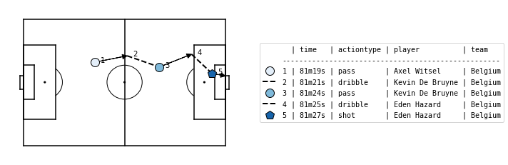
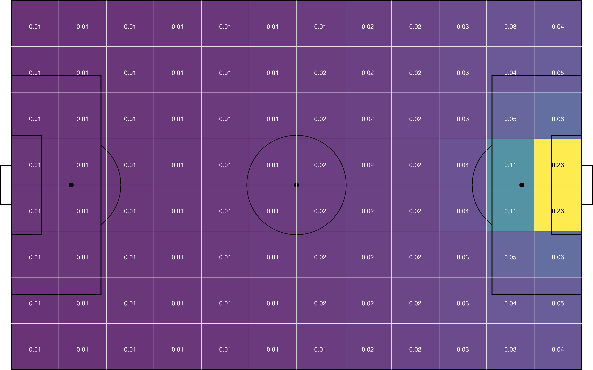
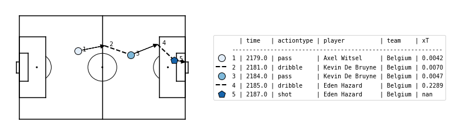

Quickstart
===========

Eager to get started valuing some soccer actions? This page gives a quick
introduction on how to get started.

Installation
------------

First, make sure that socceraction is installed:

.. code-block:: console

   $ pip install socceraction

For detailed instructions and other installation options, check out our
detailed :doc:`installation instructions <install>`.

Loading event stream data
-------------------------

First of all, you will need some data. Luckily, both `StatsBomb <https://github.com/statsbomb/open-data>`_ and
`Wyscout <https://www.nature.com/articles/s41597-019-0247-7>`_ provide a small freely available dataset.
The :ref:`data module<api-data>` of socceraction makes it trivial to load these datasets as
`Pandas DataFrames <https://pandas.pydata.org/docs/reference/api/pandas.DataFrame.html>`__.
In this short introduction, we will work with Statsbomb's dataset of the 2018 World Cup.

.. code-block:: python

   import pandas as pd
   from socceraction.data.statsbomb import StatsBombLoader

   # Set up the StatsBomb data loader
   SBL = StatsBombLoader()

   # View all available competitions
   df_competitions = SBL.competitions()

   # Create a dataframe with all games from the 2018 World Cup
   df_games = SBL.games(competition_id=43, season_id=3).set_index("game_id")

.. note::
  Keep in mind that by using the public StatsBomb data you are agreeing to their `user agreement <https://github.com/statsbomb/open-data/blob/master/LICENSE.pdf>`__.

For each game, you can then retrieve a dataframe containing the teams, all
players that participated, and all events that were recorded in that game.
Specifically, we'll load the data from the third place play-off game between
England and Belgium.

.. code-block:: python

  game_id = 8657
  df_teams = SBL.teams(game_id)
  df_players = SBL.players(game_id)
  df_events = SBL.events(game_id)

Converting to SPADL actions
---------------------------

The event stream format is not well-suited for data analysis: some of the
recorded information is irrelavant for valuing actions, each vendor uses their
own custom format and definitions, and the events are stored as unstructured
JSON objects. Therefore, socceraction uses the :doc:`SPADL format
<spadl/index>` for describing actions on the pitch. With the code below, you
can convert the events to SPADL actions.

.. code-block:: python

   import socceraction.spadl as spadl

   home_team_id = df_games.at[game_id, "home_team_id"]
   df_actions = spadl.statsbomb.convert_to_actions(df_events, home_team_id)

With the `matplotsoccer package <https://github.com/TomDecroos/matplotsoccer>`_, you can try plotting some of these
actions:

.. code-block:: python

    import matplotsoccer as mps

    # Select relevant actions
    df_actions_goal = df_actions.loc[2197:2201]
    # Replace result, actiontype and bodypart IDs by their corresponding name
    df_actions_goal = spadl.add_names(df_actions_goal)
    # Add team and player names
    df_actions_goal = df_actions_goal.merge(df_teams).merge(df_players)
    # Create the plot
    mps.actions(
        location=df_actions_goal[["start_x", "start_y", "end_x", "end_y"]],
        action_type=df_actions_goal.type_name,
        team=df_actions_goal.team_name,
        result=df_actions_goal.result_name == "success",
        label=df_actions_goal[["time_seconds", "type_name", "player_name", "team_name"]],
        labeltitle=["time", "actiontype", "player", "team"],
        zoom=False
    )

Valuing actions
---------------

We can now assign a numeric value to each of these individual actions that
quantifies how much the action contributed towards winning the game.
Socceraction implements three frameworks for doing this: xT, VAEP and
Atomic-Vaep. In this quickstart guid, we will focus on the xT framework.

The expected threat or xT model overlays a :math:`M \times N` grid on the
pitch in order to divide it into zones. Each zone :math:`z` is
then assigned a value :math:`xT(z)` that reflects how threatening teams are at
that location, in terms of scoring. An example grid is visualized below.

The code below allows you to load
league-wide xT values from the 2017-18 Premier League season (the 12x8 grid
shown above). Instructions on how to train your own model can be found in the
:doc:`detailed documentation about xT <valuing_actions/xT>`.

.. code-block:: python

    import socceraction.xthreat as xthreat

    url_grid = "https://karun.in/blog/data/open_xt_12x8_v1.json"
    xT_model = xthreat.load_model(url_grid)

Subsequently, the model can be used to value actions that successfully move
the ball between two zones by computing the difference between the threat
value on the start and end location of each action. The xT framework does not
assign a value to failed actions, shots and defensive actions such as tackles.

.. code-block:: python

    df_actions_ltr = spadl.play_left_to_right(df_actions, home_team_id)
    df_actions["xT_value"] = xT_model.rate(df_actions_ltr)

-----------------------

Ready for more? Check out the detailed documentation about the
:doc:`data representation <spadl/index>` and
:doc:`action value frameworks <valuing_actions/index>`.
