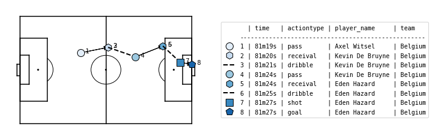

.. _Atomic-SPADL:

Atomic-SPADL
============

Definitions
-----------

Atomic-SPADL is an alternative version of SPADL which removes the `result`
attribute from SPADL and adds a few new action types. Each action is a now a tuple
of the following eleven attributes:

.. list-table::
  :widths: 20 80
  :header-rows: 1

  * - Attribute
    - Description
  * - game_id
    - the ID of the game in which the action was performed
  * - period_id
    - the ID of the game period in which the action was performed
  * - seconds
    - the action's start time
  * - player
    - the player who performed the action
  * - team
    - the player's team
  * - x
    - the x location where the action started
  * - y
    - the y location where the action started
  * - dx
    - the distance covered by the action along the x-axis
  * - dy
    - the distance covered by the action along the y-axis
  * - action_type
    - the type of the action (e.g., pass, shot, dribble)
  * - bodypart
    - the player's body part used for the action

In this representation, all actions are `atomic` in the sense that they are
always completed successfully without interruption. Consequently, while SPADL
treats a pass as one action consisting of both the initiation and receival of
the pass, Atomic-SPADL sees giving and receiving a pass as two separate
actions. Because not all passes successfully reach a teammate, Atomic-SPADL
introduces an `interception` action if the ball was intercepted by the other
team or an `out` event if the ball went out of play. Atomic-SPADL similarly
divides shots, freekicks, and corners into two separate actions. Practically,
the effect is that this representation helps to distinguish the contribution
of the player who initiates the action (e.g., gives the pass) and the player
who completes the action (e.g., receives the pass).

Example
-------

SPADL actions can be converted to their atomic version with the
:func:`~socceraction.atomic.spadl.convert_to_atomic` function.

.. code-block:: python

  import socceraction.atomic.spadl as atomicspadl

  df_atomic_actions = atomicspadl.convert_to_atomic(df_actions)

This is what Belgium’s second goal against England in the third place play-off
in the 2018 FIFA world cup looks like in the Atomic-SPADL format.

+---------+-----------+--------------+---------+-----------+-------+------+------+-------+------------+---------------+
| game_id | period_id | seconds      | team    | player    | x     | y    | dx   | dy    | actiontype | bodypart      |
+=========+===========+==============+=========+===========+=======+======+======+=======+============+===============+
| 8657    | 2         | 2179         | Belgium | Witsel    | 37.1  | 44.8 | 0.0  | 0.0   | dribble    | foot          |
+---------+-----------+--------------+---------+-----------+-------+------+------+-------+------------+---------------+
| 8657    | 2         | 2179         | Belgium | Witsel    | 37.1  | 44.8 | 16.8 | 3.4   | pass       | foot          |
+---------+-----------+--------------+---------+-----------+-------+------+------+-------+------------+---------------+
| 8657    | 2         | 2180         | Belgium | De Bruyne | 53.8  | 48.2 | 0.0  | 0.0   | receival   | foot          |
+---------+-----------+--------------+---------+-----------+-------+------+------+-------+------------+---------------+
| 8657    | 2         | 2181         | Belgium | De Brunne | 53.8  | 48.2 | 16.8 | -6.0  | dribble    | foot          |
+---------+-----------+--------------+---------+-----------+-------+------+------+-------+------------+---------------+
| 8657    | 2         | 2184         | Belgium | De Bruyne | 70.6  | 42.2 | 16.8 | 6.9   | pass       | foot          |
+---------+-----------+--------------+---------+-----------+-------+------+------+-------+------------+---------------+
| 8657    | 2         | 2184         | Belgium | Hazard    | 87.4  | 49.1 | 0.0  | 0.0   | receival   | foot          |
+---------+-----------+--------------+---------+-----------+-------+------+------+-------+------------+---------------+
| 8657    | 2         | 2185         | Belgium | Hazard    | 87.4  | 49.1 | 10.6 | -10.3 | dribble    | foot          |
+---------+-----------+--------------+---------+-----------+-------+------+------+-------+------------+---------------+
| 8657    | 2         | 2187         | Belgium | Hazard    | 97.9  | 38.7 | 7.1  | -1.4  | shot       | foot          |
+---------+-----------+--------------+---------+-----------+-------+------+------+-------+------------+---------------+
| 8657    | 2         | 2187         | Belgium | Hazard    | 105.0 | 37.4 | 0.0  | 0.0   | goal       | foot          |
+---------+-----------+--------------+---------+-----------+-------+------+------+-------+------------+---------------+

.. seealso::

  This `notebook`__ gives an example of the complete pipeline to download public
  StatsBomb data and convert it to the Atommic-SPADL format.

__ https://github.com/ML-KULeuven/socceraction/blob/master/public-notebooks/ATOMIC-1-load-and-convert-statsbomb-data.ipynb
