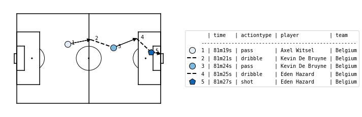

.. _SPADL:

SPADL
=====

Definitions
-----------

SPADL (*Soccer Player Action Description Language*) represents a game as
a sequence of on-the-ball actions :math:`[a_1, a_2, . . . , a_m]`, where
:math:`m` is the total number of actions that happened in the game. Each
action is a tuple of the same twelve attributes:

.. list-table::
  :widths: 20 80
  :header-rows: 1

  * - Attribute
    - Description
  * - game_id
    - the ID of the game in which the action was performed
  * - period_id
    -  the ID of the game period in which the action was performed
  * - seconds
    -  the action's start time
  * - player
    -  the player who performed the action
  * - team
    -  the player's team
  * - start_x
    -  the x location where the action started
  * - start_y
    -  the y location where the action started
  * - end_x
    -  the x location where the action ended
  * - end_y
    -  the y location where the action ended
  * - action_type
    -  the type of the action (e.g., pass, shot, dribble)
  * - result
    -  the result of the action (e.g., success or fail)
  * - bodypart
    -  the player's body part used for the action

Start and End Locations
  SPADL uses a standardized coordinate system with the origin on the bottom
  left of the pitch, and a uniform field of 105m x 68m. For direction of play,
  SPADL uses the "home team attacks to the right" convention, but this can be
  converted conveniently with the :func:`~socceraction.spadl.play_left_to_right`
  function such that the lower x-coordinates represent the own half of the team
  performing the action.

Action Type
  The action type attribute can have 22 possible values. These are `pass`,
  `cross`, `throw-in`, `crossed free kick`, `short free kick`, `crossed
  corner`, `short corner`, `take-on`, `foul`, `tackle`, `interception`,
  `shot`, `penalty shot`, `free kick` `shot`, `keeper save`, `keeper claim`,
  `keeper punch`, `keeper pick-up`, `clearance`, `bad touch`, `dribble` and
  `goal kick`. A detailed definition of each action type is available
  :doc:`here <SPADL_definitions>`.
Result
  The result attribute can either have the value `success`, to indicate that
  an action achieved it’s intended result; or the value `fail`, if this was
  not the case. An example of a successful action is a pass which reaches
  a teammate. An example of an unsuccessful action is a pass which goes over
  the sideline. Some action types can have special results. These are
  `offside` (for passes, corners and free-kicks), `own goal` (for shots), and
  `yellow card` and `red card` (for fouls).
Body Part
  The body part attribute can have 4 possible values. These are `foot`, `head`,
  `other` and `none`. For Wyscout, which does not distinguish between the
  head and other body parts a special body part `head/other` is used.

All actions, except for some dribbles, are derived from an event in the
original event stream data. They can be linked back to the original data by
the `original_event_id` attribute. Synthetic dribbles are added to fill gaps
between two events. These synthetic dribbles do not have an
`original_event_id`.

Example
-------

Socceraction currently implements converters for
:mod:`StatsBomb <socceraction.spadl.statsbomb>`,
:mod:`Wyscout <socceraction.spadl.wyscout>`, and
:mod:`Opta <socceraction.spadl.opta>`
event stream data. We'll use StatsBomb data to illustrate the API, but the API
of the other converters is identical.

First, we load the event stream data of the third place play-off in the 2018
FIFA World Cup between Belgium and England.

.. code-block:: python

  from socceraction.data.statsbomb import StatsBombLoader

  SBL = StatsBombLoader()
  df_events = SBL.events(game_id=8657)

These events can now be converted to SPADL using the :func:`~socceraction.spadl.statsbomb.convert_to_actions`
function of the StatsBomb converter.

.. code-block:: python

  import socceraction.spadl as spadl

  df_actions = spadl.statsbomb.convert_to_actions(df_events, home_team_id=777)

The obtained dataframe represents the body part, result, action type, players
and teams with numeric IDs. The code below adds their corresponding names.

.. code-block:: python

  df_actions = (
    spadl
    .add_names(df_actions)  # add actiontype and result names
    .merge(SBL.teams(game_id=8657))  # add team names
    .merge(SBL.players(game_id=8657))  # add player names
  )

Below are the five actions in the SPADL format leading up to Belgium's
second goal.

+---------+-----------+---------+---------+-----------+----------+----------+--------+--------+------------+---------+----------+
| game_id | period_id | seconds | team    | player    | start\_x | start\_y | end\_x | end\_y | actiontype | result  | bodypart |
+=========+===========+=========+=========+===========+==========+==========+========+========+============+=========+==========+
| 8657    | 2         | 2179    | Belgium | Witsel    | 37.1     | 44.8     | 53.8   | 48.2   | pass       | success | foot     |
+---------+-----------+---------+---------+-----------+----------+----------+--------+--------+------------+---------+----------+
| 8657    | 2         | 2181    | Belgium | De Bruyne | 53.8     | 48.2     | 70.6   | 42.2   | dribble    | success | foot     |
+---------+-----------+---------+---------+-----------+----------+----------+--------+--------+------------+---------+----------+
| 8657    | 2         | 2184    | Belgium | De Bruyne | 70.6     | 42.2     | 87.4   | 49.1   | pass       | success | foot     |
+---------+-----------+---------+---------+-----------+----------+----------+--------+--------+------------+---------+----------+
| 8657    | 2         | 2185    | Belgium | Hazard    | 87.4     | 49.1     | 97.9   | 38.7   | dribble    | success | foot     |
+---------+-----------+---------+---------+-----------+----------+----------+--------+--------+------------+---------+----------+
| 8657    | 2         | 2187    | Belgium | Hazard    | 97.9     | 38.7     | 105    | 37.4   | shot       | success | foot     |
+---------+-----------+---------+---------+-----------+----------+----------+--------+--------+------------+---------+----------+

Here is the same phase visualized using the ``matplotsoccer`` package

.. seealso::

  This `notebook`__ gives an example of the complete pipeline to download public
  StatsBomb data and convert it to the SPADL format.

__ https://github.com/ML-KULeuven/socceraction/blob/master/public-notebooks/1-load-and-convert-statsbomb-data.ipynb
