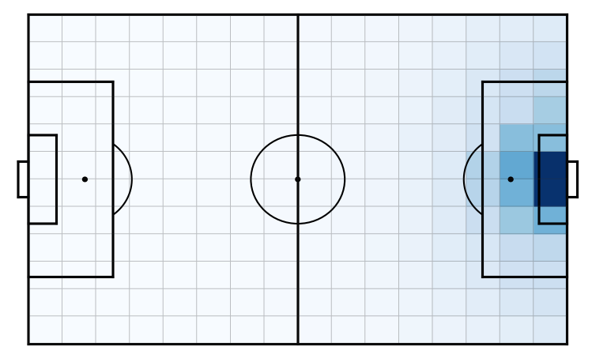

xT
---

The expected threat or xT model is a possession-based model. That is, it
divides matches into possessions, which are periods of the game where the same
team has control of the ball. The key insights underlying xT are that (1)
players perform actions with the intention to increase their team's chance of
scoring, and (2) the chance of scoring can be adequately captured by only
considering the location of the ball.

Point (2) means that xT represents a game state solely by using the current
location of the ball. Therefore, xT overlays a :math:`M \times N` grid on the pitch in order
to divide it into zones. Each zone :math:`z` is then assigned a value :math:`xT(z)` that
reflects how threatening teams are at that location, in terms of scoring.
These xT values are illustrated in the figure below. Cells with a darker blue
color have a higher xT value.

The value of each zone can be learned with a Markov decision process. For an
intuitive explanation of how this works, we refer to `Karun's blog post
<https://karun.in/blog/expected-threat.html>`_.

.. code-block:: python

    import socceraction.xthreat as xthreat
    import socceraction.vaep.features as fs

    # 1. Convert direction of play
    [actions] = fs.play_left_to_right([actions], game.home_team_id)

    # 2. Train xT model
    xTModel = xthreat.ExpectedThreat(l=16, w=12)
    xTModel.fit(actions)

    # 3. Rate ball-progressing actions
    # xT should only be used to value actions that move the ball
    # and that keep the current team in possession of the ball
    mov_actions = xthreat.get_successful_move_actions(actions)
    mov_actions["xT_value"] = xTModel.predict(mov_actions)

.. seealso:: 

  This `notebook`__ gives an example of the complete pipeline to train and
  apply an xT model.

__ https://github.com/ML-KULeuven/socceraction/blob/master/public-notebooks/EXTRA-run-xT.ipynb

